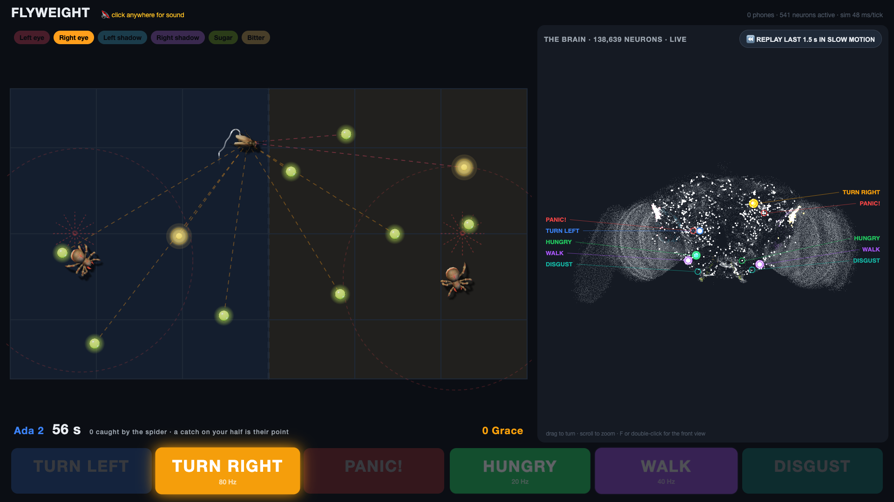

# Flyweight

A party game where a room full of people plays against a fruit fly, and the fly's decisions
come from a simulation of a real fly brain: the complete FlyWire wiring diagram, 138,639 neurons
and about 50 million connections, running live on a laptop.

Nobody steers the fly. Two players each own half of the arena and tap their phone to drop sugar
on their own half or bitter on the other one. The fly sees, smells, tastes and decides for
itself; two spiders hunt it. The big screen shows the arena next to the brain, with every spike
drawn where that neuron sits in the real brain.



It was built for an AI workshop with about 20 people, half of them non-technical. The point of
the evening: nobody trained this brain. There is no learning, no data and no prompt in it, only
structure copied from nature, and it still behaves like a fly.

## What you need

- A laptop to run the server. Developed on an Apple Silicon MacBook Pro; macOS or Linux.
- Python 3.11 or newer.
- A big screen or beamer for the laptop.
- Phones on the same network as the laptop. Nothing to install on them.
- About 225 MB of download for the connectome, once.

## Quick start

```bash
git clone <this repo> flyweight && cd flyweight
python3 -m venv .venv && source .venv/bin/activate
pip install -r requirements.txt
./fetch_data.sh          # connectome + annotations into data/upstream/, ~225 MB
python server.py
```

The first start builds a cache of the connectome (about 117 MB in `data/`), which takes a
moment. After that the terminal prints three addresses and a QR code:

| Page | Who | What |
|---|---|---|
| `/` | the beamer | arena, live brain view, scores, join QR code |
| `/play` | phones | type a name, take a seat, tap to drop sugar or bitter |
| `/host` | the host | start and stop heats, switch between DUEL and 4 PLAYERS |

Open `/` on the laptop, put it on the big screen, and click once anywhere on the page so the
browser allows sound. Players scan the QR code.

Keys on the beamer page: `R` replays the last 1.5 s of brain activity at 1/10 speed, `M` mutes,
`F` snaps the brain to the front view. Drag the brain to turn it, scroll to zoom.

To check the simulator without the game:

```bash
python sim/brain.py 0.5         # smoke test and speed benchmark
python sim/demo_autopilot.py    # the brain steers a fly to a target, headless
python sim/demo_world.py        # the fly hunts drops and flees the spider on its own
```

## Networks

The server listens on every network interface and works out its own address each time the QR
code is requested, so you can move the laptop to another wifi network and the QR code on the
beamer follows within 15 seconds. No configuration is needed in the normal case. Everything is
served from the laptop; no internet connection is needed during play.

If phones cannot connect, it is almost always one of these:

- **A VPN on the laptop.** The server skips VPN addresses when it picks the one to advertise,
  but many VPN clients also block incoming connections from the local network. Turn the VPN
  off, or allow local network access in its settings.
- **Not the same network.** Phones on mobile data, or on a guest wifi that keeps devices apart
  from each other (client isolation), cannot reach the laptop. A phone hotspot or a travel
  router works well.
- **The firewall.** macOS asks once whether Python may accept incoming connections. Say yes.
- **The wrong address was picked.** The terminal lists the others under "other addresses".
  Force one with `FLY_HOST`:

```bash
FLY_HOST=192.168.1.20 python server.py   # advertise this address in the QR code
FLY_PORT=9000 python server.py           # use another port than 8000
```

An iPhone hotspot accepts only a handful of devices, which limits how many phones can join.

## The game

- **Duel**: two players, one fly, 90 seconds. Tap your own half to drop sugar (one per 2 s),
  tap the other half to drop bitter (one per 4 s). Bitter next to a sugar drop spoils it: the
  fly walks up, tastes, refuses and leaves. A drop eaten on your half is your point.
- **Spiders**: one per half. A spider charges when the fly comes within sight. A fly caught on
  your half is a point for your opponent, so luring the fly into a spider is a legitimate play.
- **No dumping sugar on the fly**: a drop that lands right next to the fly startles it, and it
  jumps away. Lure it from a distance.
- **4 players**: the same rules on four quadrants, switched on the host page between heats.
- The fly sometimes faints. That is a real property of the model (a runaway of activity that
  the server detects and resets), not a bug in the game.

## How it works

`sim/brain.py` is a leaky integrate-and-fire model of the whole brain, a numpy/scipy
re-implementation of the model by Shiu et al. with a stepping interface, so a game loop can
change the sensory input while the brain keeps running. On the MacBook it runs slightly faster
than real time.

Twenty times a second the server does this:

1. `sim/senses.py` turns the world (drops, spiders, shadows) into firing rates on the fly's
   real sensory neurons.
2. The brain runs 50 ms.
3. `sim/body.py` turns the firing rates of a few known output neurons into movement: turn
   left, turn right, walk, jump, feed.
4. `sim/world.py` applies the game rules, and the server sends the state and the spikes to
   every connected page.

Those two files, `senses.py` and `body.py`, are the only places where hand-written code touches
the brain. Everything between them is the connectome. Where the game needed a fudge, it is in
one of those two files with a comment that says so.

[docs/findings.md](docs/findings.md) is the lab notebook: what this brain does and does not do,
with measurements. Some of it is unflattering. The model has no resting state and no memory of
any kind, and several ideas for the game failed for that reason.

```
server.py            FastAPI + WebSockets, simulation thread, game state
sim/                 brain, senses, body, world, headless demos, data build scripts
web/                 beamer page, phone page, host page; three.js is vendored (works offline)
data/neurons.json    which neurons are the senses and the outputs
data/positions.bin   a 3D position for every neuron, for the brain view
docs/findings.md     measurements and negative results
```

## Status

Built for one evening. It was tested by playing it; there is no automated test suite. The
balance numbers (drop cooldowns, spider sight, startle radius) were tuned by hand and are
documented in `docs/findings.md`.

## Credits and licences

- **Brain model**: Shiu et al., [Drosophila_brain_model](https://github.com/philshiu/Drosophila_brain_model), MIT.
- **Connectome**: [FlyWire](https://flywire.ai), **non-commercial use only**. Cite Dorkenwald
  et al. 2024 and Schlegel et al. 2024. `data/neurons.json` and `data/positions.bin` are derived
  from it and fall under the same terms. Fine for a workshop; do not ship it in a product.
- **Spider model**: based on ["Spider animated character"](https://sketchfab.com/3d-models/spider-animated-character-746f5c5173ce4f47ad0970b62ee4106e)
  by [TheGameAssets](https://sketchfab.com/TheGameAssets), licensed under
  [CC BY 4.0](https://creativecommons.org/licenses/by/4.0/). Converted to glTF in Blender.
- **Fly model**: based on ["Муха"](https://sketchfab.com/3d-models/c8988274b3fc41cf9792032bf1dc657a)
  ("Fly") by [MUD](https://sketchfab.com/Jguyfioy), licensed under
  [CC BY 4.0](https://creativecommons.org/licenses/by/4.0/). Converted to glTF in Blender.
- **three.js**: MIT, vendored in `web/static/vendor/three/`.
- **Sound effects**: in `web/static/audio/`, recorded by Kim De Vylder, except
  `Wilhelm_scream.mp3`, the well-known film stock effect, which is not covered by this
  project's licence.

The project's own code and the sound recordings are free to use, change and
share for any noncommercial purpose, but not to sell: [PolyForm Noncommercial 1.0.0](LICENSE.md).

Required Notice: Copyright 2026 Kim De Vylder
